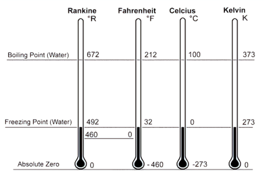

# Chapter Template

```         
# Heat {#sec-heat}

## Objectives

-   Explain water equivalent and perform calorimeter and heat calculations involving water equivalents.

## Concepts

### Temperature

We commonly think of temperature as an indication of the degree of hotness or coldness in a body. A more accurate definition would be “a measure of the level, or intensity of internal energy.”

{#fig-temp-scale}

## Classwork

## Problem Set

## Further Reading

Read Chapter X in @russell2022, for additional information.
```

# Indexing Words

```         
In mathematics and physics, a scalar\index{scalar} 
```

# Writing Examples

```         
::: {#exm-1}
A vertical 
Final Answer
:::
```

# Inserting Figures

```         
::: column-margin
{#fig-sling01}
:::
```

# Cross-referencing Figures

```         
as shown in @fig-sling01. 
```
